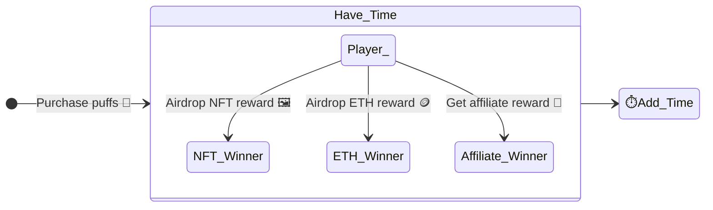
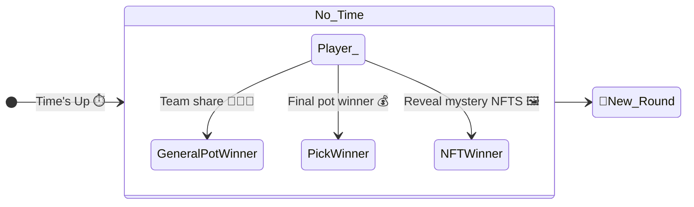
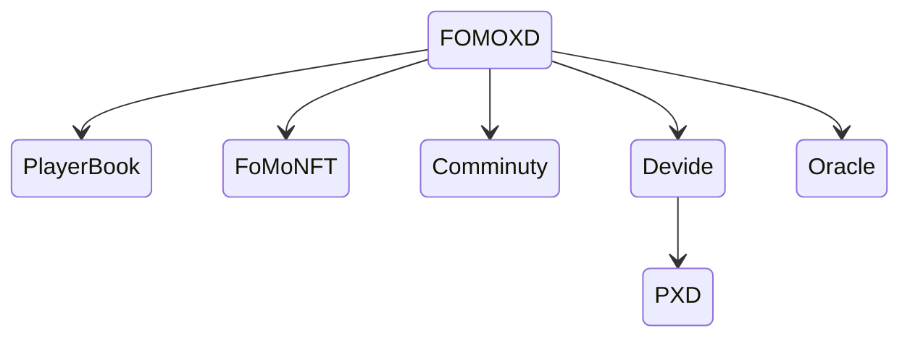
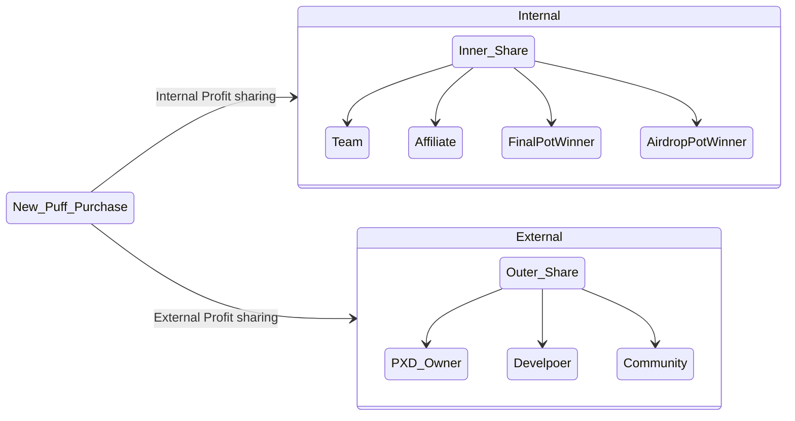
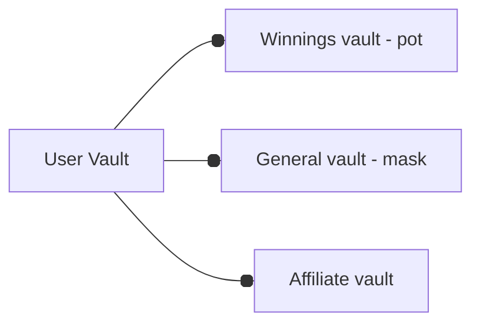
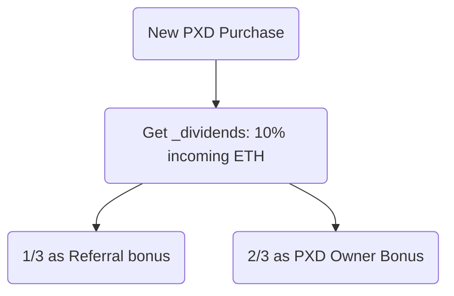

# [🧁 FoMoXD - Blockchain Dapp](https://0x171-0.github.io/fomoxd)

## A Lottery Ponzi Game

Demo website: <https://0x171-0.github.io/fomoxd>

Slides: [FomoXD](./docs/FoMoXD.pdf)

</img>
#### Rules
- Winner is the last person to purchase Puffs — a lottery ticket — using ETH before the countdown timer runs down to zero.
- During games every player has a chance to get ETH, NFT airdrops
## Feature
- Integrated Profit-sharing token, NFTs, DAO, Multi-sig wallet
- Utilizes the hardhat framework for development and testing
- As supply for Pufss increases, the price will rise

---
## Steps for E2E test

- Run the hardhat node

```bash
npx hardhat node
```
- Add the test network and account to Metamak
  - Import hardhat test private key
  - Import hardhat network


- Deploy contracts with Hardhat 

```bash
npm run deploy
```
- Update contract address in the config file

```bash
vi webapp/.env
# Add the address
REACT_APP_FOMO_CONTRACT_ADDRESS=YOUR_FOMO_CONTRACT_ADDRESS
REACT_APP_FOMOERC721_CONTRACT_ADDRESS=YOUR_FOMO_NFT_CONTRACT_ADDRESS
```
- Run the web server with docker

```bash
docker build -t fomoxd . --no-cache
docker run -p 3000:3000 fomoxd
```

## Steps for Integration Test

```bash
cd chain
npm i 
npx hardhat node
npm run test

```
---
## Game Flow






---
## Smart Contract Modules


The FoMoXD consists of the following smart contracts:

1. FoMoXD/OtherFoMoXD: Interact with users and deal with gaming logic & data
2. Player Book: A ledger of all games' leaderboards of recommended players.
3. FoMoNFT: Airdrop the NFT mystery box during each round and reveal the NFTs of the round at the end of the round.
4. PXD: A profit-sharing token that allows holders to share in the profits generated by the underlying games.
5. Comminuty: A decentralized governance system that uses a multi-sig wallet in which decisions are made and actions are taken based on the consensus of multiple parties.
6. Devide: Responsible for calculating and distributing profits to the holders of the tokens
7. Oracle: Obtaining a random number from an Oracle. Once the random number has been generated, the game then uses it to determine whether or not a player is an airdrop winner.

---
# Profit-sharing System




### Internal Profit sharing


Every user has three parts of the division vault:



#### 1. General Vault: Get team share
- Every user can choose a team when buying puffs, and it will determine how the profit share allocate.
- Every round has a mask of general vault to record amount can be shared
- Every user has a mask of general vault to record amount already withdrawed

#### 2. Affiliate Vault: Get referral share

There are 3 ways to buy puffs:

- Buy with affiliate name
- Buy with affiliate id
- Buy with affiliate address
  
If the affiliate exists in the system then the affiliate will get the affiliate share.

#### 3. Winning Vault: Final round winning share

- Final round winner share
- Airdrop winner share

### How FoMoXD share profits with every user?

- Purchase Puff: 
When user purchase puffs FoMoXD will update a global profit checker called "mask". It represent the amount of share to all the player of the sound.

```solidity
// purchase puffs
/**
 * @dev updates masks for round and player when puffs are bought
 * @return dust left over
 */
function updateMasks(
    uint256 _roundId,
    uint256 _playerID,
    uint256 _generalShare,
    uint256 _puffs,
    FXDdatasets.Teams _team
) private returns (uint256) {
    uint256 _expotions = 1000000000000000000;
    // calc profit per key & round mask based on this buy:  (dust goes to pot)
    uint256 _profitPerPuff = (_generalShare * _expotions) /
        roundData_[_roundId].puffs;

    // 💡 update global tracker based on profit per share for each round
    roundData_[_roundId].mask += _profitPerPuff;

    // calculate player earning from their own buy (only based on the puffs
    // they just bought).  & update player earnings mask
    uint256 _earning = (_profitPerPuff * _puffs) / _expotions;
    playerRoundsData_[_playerID][_roundId].mask +=
        ((roundData_[_roundId].mask * _puffs) / _expotions) -
        (_earning);

    // calculate & return dust
    return (_generalShare -
        ((_profitPerPuff * (roundData_[_roundId].puffs)) / (_expotions)));
}
```

- Withdraw: Every user also has a "mask" in their round data to record profit they have withdrawed.

`earnAmountCanBeWithdraw = roundData_.mask * player.puffs / 1e18 - player.mask`

```solidity
// withdraw
/**
 * @dev adds up unmasked earnings, & vault earnings, sets them all to 0
 * @return earnings in wei format
 */
function withdrawEarnings(uint256 _pID) private returns (uint256) {
    // 1️⃣ update generalShare vault
    updateGeneralVault(_pID, player_[_pID].lastRound);

    // from vaults
    uint256 _earnings = player_[_pID].winningVault +
        player_[_pID].generalVault +
        player_[_pID].affiliateVault;
    if (_earnings > 0) {
        player_[_pID].winningVault = 0;
        player_[_pID].generalVault = 0;
        player_[_pID].affiliateVault = 0;
    }

    return (_earnings);
}

/**
 * @dev moves any unmasked earnings to generalShare vault.  updates earnings mask
 */
function updateGeneralVault(uint256 _pID, uint256 _rIDlast) private {
    // 2️⃣ calcuate mask earning
    uint256 _generalEarnings = calcUnMaskedEarnings(_pID, _rIDlast);
    if (_generalEarnings > 0) {
        // put in generalShare vault
        player_[_pID].generalVault += _generalEarnings;
        // zero out their earnings by updating mask
        playerRoundsData_[_pID][_rIDlast].mask += _generalEarnings;
    }
}

/**
 * @dev calculates unmasked earnings (just calculates, does not update mask)
 * @return earnings in wei format
 */
function calcUnMaskedEarnings(
    uint256 _pID,
    uint256 _rIDlast
) private view returns (uint256) {
    // 3️⃣ earning = roundMaskProfit - userMaskProfit
    return ((roundData_[_rIDlast].mask *
        (playerRoundsData_[_pID][_rIDlast].puffs) / 1000000000000000000) -
        playerRoundsData_[_pID][_rIDlast].mask);
}

```


### External Profit sharing

There are three groups can gain external share

1. PXD: PXD is the token for the FOMOXD game. PXD holders will be getting dividends from FOMOXD’s volume
2. Community: Early investor and community
3. DEV Team: Developer team

# PoWH3D (P3D) token profit sharing 



###  How PXD share profits with users?

- Record profit per share after each purcahse

```solidity
function purchaseTokens(
    uint256 _incomingEthereum,
    address _referredBy // 推薦人
) internal antiEarlyWhale(_incomingEthereum) returns (uint256) {
  /// ...
  // take the amount of dividends gained through this transaction, and allocates them evenly to each shareholder
  profitPerShare_ += ((_dividends * magnitude) / (tokenSupply_));
  /// ...
}
```

- User remain share = profitPerShare * totalShareUserOwned - profitWithdrawed

```solidity
function dividendsOf(
    address _customerAddress
) public view returns (uint256) {
    return
        (uint256)(
            (int256)(profitPerShare_ * _balances[_customerAddress]) -
                payoutsTo_[_customerAddress]
        ) / magnitude;
}
```

- Record profit user withdrawed after each withdraw

```solidity
function withdraw() public onlyStronghands {
  /// ...
  uint256 _dividends = myDividends(false); // get ref. bonus later in the code

  // update dividend tracker (amount user already withdraw)
  payoutsTo_[_customerAddress] += (int256)(_dividends * magnitude);
  /// ...
}
```


---

# Todo

## Chain

[ ] Decentralize Governance system

---

## Client

[ ] Profit-sharing Token Page

# Credits
- [Style Guide](https://docs.soliditylang.org/en/v0.8.17/common-patterns.html)
- [FoMo3D](https://github.com/reedhong/fomo3d_clone)

### NFT Images
- <https://giventofly.github.io/pixelit/>
- [JillyPuff](https://twitter.com/scrixels/status/1136653042642817024)

### Music Credit
-  Background
   - [Youtube Studio](https://studio.youtube.com/channel/UCt4Szwqj1S7I_hA4eZvwK5g/music)
   - [Half.cool](https://www.youtube.com/channel/UCtkVGyrwbsvv0yU6Hn5RG4A)
- Sound Effect
  - [Coin](https://sc.chinaz.com/yinxiao/220716414170.htm)
  - [on/off sound comes from](https://taira-komori.jpn.org/openclose01tw.html)

### References
