# [🧁 FoMoXD - Blockchain Dapp](https://0x171-0.github.io/fomoxd)

## A Lottery Ponzi Game

Demo website : <https://0x171-0.github.io/fomoxd>

Slides: [FomoXD](./docs/FoMoXD.pdf)

</img>
#### Rules
- Winner is the last person to purchase Puffs — a lottery ticket — using ETH before the countdown timer runs down to zero.
- During games every player has chance to get ETH, NFT airdrops
## Feature
- Integrated Profit-sharing token, NFTs, DAO, Multi-sig wallet
- Utilizes the hardhat framework for development and testing
- As supply for Pufss increases, the price will rise

---
## Steps for E2E test

- Run the hardhat node

```bash
npx hardhat node
```
- Add the test network and account to Metamak
  - Import hardhat test private key
  - Import hardhat network


- Deploy contracts with Hardhat 

```bash
npm run deploy
```
- Update Contract Address in config file

```bash
vi webapp/.env
# Add the address
REACT_APP_FOMO_CONTRACT_ADDRESS=YOUR_FOMO_CONTRACT_ADDRESS
REACT_APP_FOMOERC721_CONTRACT_ADDRESS=YOUR_FOMO_NFT_CONTRACT_ADDRESS
```
- Run the web server with docker

```bash
docker build -t fomoxd . --no-cache
docker run -p 3000:3000 fomoxd
```

## Steps for Integration Test

```bash
cd chain
npm i 
npx hardhat node
npm run test

```
---
## Game Flow

```mermaid
stateDiagram
    direction LR
    [*] --> Have_Time: Purchase puffs 🧁
    state Have_Time {
      Player_ --> NFT_Winner: Airdrop NFT reward 🖼️
      Player_ --> ETH_Winner: Airdrop ETH reward 🪙
      Player_ --> Affiliate_Winner: Get affiliate reward 👥
    }
    Have_Time --> ⏱️Add_Time
```

```mermaid
stateDiagram
      direction LR
    [*] --> No_Time: Time's Up ⏱️
    state No_Time{
      Player_  --> GeneralPotWinner: Team share 🧑‍🤝‍🧑
      Player_  --> PickWinner: Final pot winner 💰
      Player_  --> NFTWinner: Reveal mystery NFTS 🖼️
    }
    No_Time --> 🏁New_Round
```







## Smart Contract Modules


1. FoMoXD/OtherFoMoXD: Interact with users and deal with gaming logic & data
2. Player Book: A ledger of all games' leaderboard of recommended players.
3. FoMoNFT: Airdrop NFT mystery box during each round and reveal NFTs of the round at the end of the round.
4. PXD: A profit-sharing tokens that allows holders to share in the profits generated by the underlying games.
5. Comminuty: A decentralized governance system that uses a multi-sig wallet which decisions are made and actions are taken based on the consensus of multiple parties.
6. Devide: Responsible for calculating and distributing profits to the holders of the tokens
7. Oracle: Obtaining a random number from an Oracle. Once the random number has been generated, the game then use it to determine whether or not a player is a airdrop winner.

# Profit-sharing System


### Internal Profit sharing


Every user has three parts of division vault:
1. Team Vault: Get team share
2. Affiliate Vault: Get referel share
3. Winning Vault: Final round winning share


### External Profit sharing

There are three groups of users can gain external share

1. PXD: PXD is the token for the FOMOXD game. PXD holders will be getting dividends from FOMOXD’s volume
2. Community: Early invester and community
3. DEV Team: Developer team

# PoWH3D (P3D) token profit sharing 


###  How PXD share bonus to every user?

- Record profit per share after each purcahse

```solidity
function purchaseTokens(
    uint256 _incomingEthereum,
    address _referredBy // 推薦人
) internal antiEarlyWhale(_incomingEthereum) returns (uint256) {
  /// ...
  // take the amount of dividends gained through this transaction, and allocates them evenly to each shareholder
  profitPerShare_ += ((_dividends * magnitude) / (tokenSupply_));
  /// ...
}
```

- User remain share = profitPerShare * totalShareUserOwned - profitWithdrawed

```solidity

function dividendsOf(
    address _customerAddress
) public view returns (uint256) {
    return
        (uint256)(
            (int256)(profitPerShare_ * _balances[_customerAddress]) -
                payoutsTo_[_customerAddress]
        ) / magnitude;
}
```

- Record profit user withdrawed after each withdraw

```solidity
function withdraw() public onlyStronghands {
  /// ...
  uint256 _dividends = myDividends(false); // get ref. bonus later in the code

  // update dividend tracker
  // 更新使用者已提取分潤
  payoutsTo_[_customerAddress] += (int256)(_dividends * magnitude);
  /// ...
}
```


---

# Todo

## Chain

[ ] Decentralize Governance system

---

## Client

[ ] Profit-sharing Token Page

# Credits
- [Style Guide](https://docs.soliditylang.org/en/v0.8.17/common-patterns.html)
- [FoMo3D](https://github.com/reedhong/fomo3d_clone)

### NFT Images
- <https://giventofly.github.io/pixelit/>
- [JillyPuff](https://twitter.com/scrixels/status/1136653042642817024)

### Music Credit
-  Background
   - [Youtube Studio](https://studio.youtube.com/channel/UCt4Szwqj1S7I_hA4eZvwK5g/music)
   - [Half.cool](https://www.youtube.com/channel/UCtkVGyrwbsvv0yU6Hn5RG4A)
- Sound Effect
  - [Coin](https://sc.chinaz.com/yinxiao/220716414170.htm)
  - [on/off sound comes from](https://taira-komori.jpn.org/openclose01tw.html)

### References
